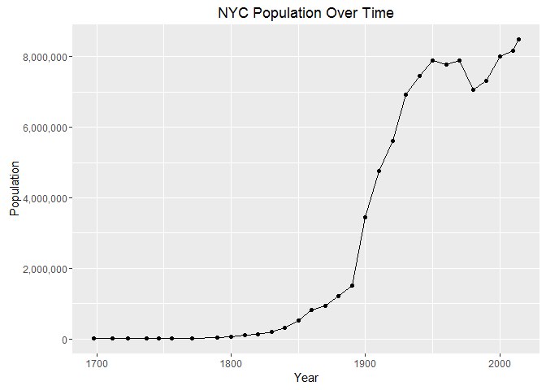
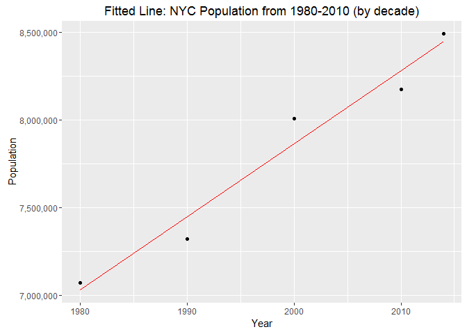
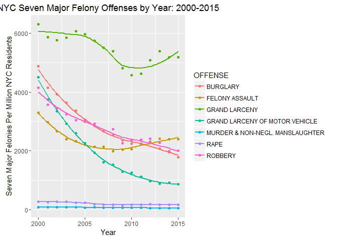
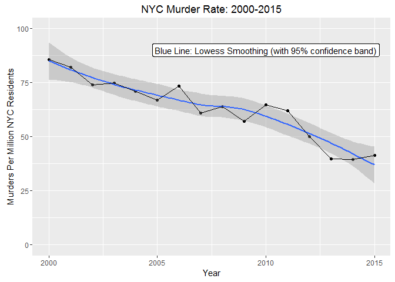
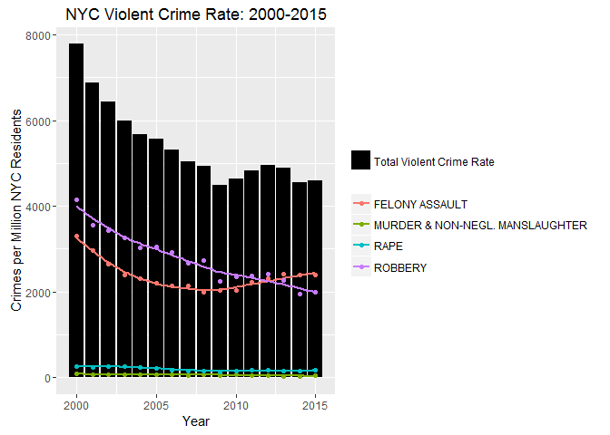

New York City Crime & Population Trends
================
Brent Brewington (github.com/bbrewington)
September 27, 2016

#### Read crime & population data into R:

##### Scrape NYC Population Data from Wikipedia

``` r
nyc.population <- read_html("https://en.wikipedia.org/wiki/Demographics_of_New_York_City") %>% 
     html_nodes(".toccolours") %>% html_table() %>% as.data.frame() %>% 
     .[2:32,1:2] %>% 
     select(year = Historical.population, population = Historical.population.1) %>%     
     mutate(year = as.numeric(year), population = parse_number(population))
glimpse(nyc.population)
```

    ## Observations: 31
    ## Variables: 2
    ## $ year       <dbl> 1698, 1712, 1723, 1737, 1746, 1756, 1771, 1790, 180...
    ## $ population <dbl> 4937, 5840, 7248, 10664, 11717, 13046, 21863, 33131...

##### Get Crime Data from nyc.gov/html/nypd:

1.  Downloaded Excel (.xls) file: <http://www.nyc.gov/html/nypd/downloads/excel/analysis_and_planning/seven_major_felony_offenses_2000_2015.xls>
2.  Copy+Paste data into csv file
3.  Read into R via readr::read\_csv

``` r
nyc.crime <- read_csv("nyc_crimedata_2000-2015.csv", col_names = TRUE) %>% 
     gather(year, crime.count, `2000`:`2015`) %>% 
     mutate(year = as.numeric(year))
glimpse(nyc.crime)
```

    ## Observations: 112
    ## Variables: 3
    ## $ OFFENSE     <chr> "MURDER & NON-NEGL. MANSLAUGHTER", "RAPE", "ROBBER...
    ## $ year        <dbl> 2000, 2000, 2000, 2000, 2000, 2000, 2000, 2001, 20...
    ## $ crime.count <int> 673, 2068, 32562, 25924, 38352, 49631, 35442, 649,...

##### Plot of NYC population trend



##### Fit linear model to NYC population (1980-2010)

    ## 
    ## Call:
    ## lm(formula = nyc.population1$population ~ nyc.population1$year)
    ## 
    ## Residuals:
    ##       1       2       3       4       5 
    ##   40845 -124691  144572 -105044   44317 
    ## 
    ## Coefficients:
    ##                       Estimate Std. Error t value Pr(>|t|)   
    ## (Intercept)          -75428524    9289882  -8.119  0.00391 **
    ## nyc.population1$year     41646       4648   8.961  0.00293 **
    ## ---
    ## Signif. codes:  0 '***' 0.001 '**' 0.01 '*' 0.05 '.' 0.1 ' ' 1
    ## 
    ## Residual standard error: 130500 on 3 degrees of freedom
    ## Multiple R-squared:  0.964,  Adjusted R-squared:  0.952 
    ## F-statistic: 80.29 on 1 and 3 DF,  p-value: 0.002933



NYC population from 1980-2010 = -75428524 + (41646 \* year)

##### Create dataset: NYC Crime Rate 2000-2015

``` r
nyc.population_crime <- data.frame(year = 2000:2015) %>% 
     mutate(population.est = -75428524 + 41646 * year) %>%
     left_join(nyc.crime, by = "year") %>%
     mutate(crime.rate = crime.count / population.est) %>% 
     mutate(crime.rate_per.million = crime.rate * 1000000)
```

    ## Observations: 112
    ## Variables: 6
    ## $ year                   <dbl> 2000, 2000, 2000, 2000, 2000, 2000, 200...
    ## $ population.est         <dbl> 7863476, 7863476, 7863476, 7863476, 786...
    ## $ OFFENSE                <chr> "MURDER & NON-NEGL. MANSLAUGHTER", "RAP...
    ## $ crime.count            <int> 673, 2068, 32562, 25924, 38352, 49631, ...
    ## $ crime.rate             <dbl> 8.558556e-05, 2.629880e-04, 4.140917e-0...
    ## $ crime.rate_per.million <dbl> 85.58556, 262.98802, 4140.91682, 3296.7...

##### Create dataset: NYC Violent Crime Rate 2000-2015

``` r
nyc.population_violentcrime <- data.frame(year = 2000:2015) %>% 
     mutate(population.est = -75428524 + 41646 * year) %>%
     left_join(nyc.crime %>% filter(OFFENSE %in% c("MURDER & NON-NEGL. MANSLAUGHTER", "RAPE", "ROBBERY", "FELONY ASSAULT")) %>% group_by(year) %>% 
                    summarise(crime.count = sum(crime.count)), by = "year") %>%
     mutate(crime.rate = crime.count / population.est, 
            crime.rate_per.million = 1000000 * crime.count / population.est)
```

    ## Observations: 16
    ## Variables: 5
    ## $ year                   <dbl> 2000, 2001, 2002, 2003, 2004, 2005, 200...
    ## $ population.est         <dbl> 7863476, 7905122, 7946768, 7988414, 803...
    ## $ crime.count            <int> 61227, 54285, 51107, 47795, 45470, 4486...
    ## $ crime.rate             <dbl> 0.007786251, 0.006867067, 0.006431168, ...
    ## $ crime.rate_per.million <dbl> 7786.251, 6867.067, 6431.168, 5983.040,...

### Plots

``` r
ggplot(nyc.population_crime, aes(year, crime.rate_per.million, color = OFFENSE)) + geom_point() + geom_smooth(se = FALSE) + ggtitle("NYC Seven Major Felony Offenses by Year: 2000-2015") +
     xlab("Year") + ylab("Crimes Per Million NYC Residents")
```



``` r
ggplot(nyc.population_crime %>% filter(OFFENSE == "MURDER & NON-NEGL. MANSLAUGHTER"), aes(year, crime.rate_per.million)) + geom_point() + geom_smooth(se = FALSE) + geom_line() +
     xlab("Year") + ylab("Crimes Per Million NYC Residents") + ggtitle("NYC Murder Rate: 2000-2015")
```



``` r
ggplot(nyc.population_violentcrime, aes(year, crime.rate_per.million)) + geom_bar(stat = "identity", aes(fill = "Total Violent Crime Rate")) + geom_smooth(data = nyc.population_crime %>% filter(OFFENSE %in% c("MURDER & NON-NEGL. MANSLAUGHTER", "RAPE", "ROBBERY", "FELONY ASSAULT")), aes(x = year, y = crime.rate_per.million, color = OFFENSE), se = FALSE) + geom_point(data = nyc.population_crime %>% filter(OFFENSE %in% c("MURDER & NON-NEGL. MANSLAUGHTER", "RAPE", "ROBBERY", "FELONY ASSAULT")), aes(x = year, y = crime.rate_per.million, color = OFFENSE)) + scale_fill_manual(values = "black", name = NULL) + scale_color_discrete(name = NULL) +
     ggtitle("NYC Violent Crime Rate: 2000-2015") + ylab("Crimes per Million NYC Residents") + xlab("Year")
```


